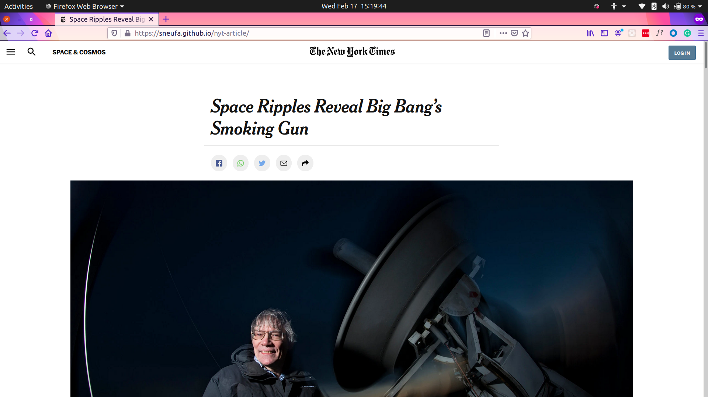

# Positioning and Floating Elements

> This assignment consists of making a clone of a [New York Times article page](https://www.nytimes.com/2014/03/18/science/space/detection-of-waves-in-space-buttresses-landmark-theory-of-big-bang.html?_r=0). You will learn and apply these concepts to the project:

- Embedding images
- The box model
- Flexbox
- Positioning

Additional description about the project and its features.

## Built With

- HTML & CSS

## Live Demo

[New York Times Article Clone](https://sneufa.github.io/nyt-article/)

## Getting Started

**This is an example of how you may give instructions on setting up your project locally.**
**Modify this file to match your project, remove sections that don't apply. For example: delete the testing section if the currect project doesn't require testing.**

To get a local copy up and running follow these simple example steps.

### Prerequisites

### Setup

### Install

### Usage

### Run tests

### Deployment

## Authors

👤 **Author1**

- GitHub: [@githubhandle](https://github.com/sneufa)
- Twitter: [@twitterhandle](https://twitter.com/sneufa)

## 🤝 Contributing

Contributions, issues, and feature requests are welcome!

Feel free to check the [issues page](issues/).

## Show your support

Give a ⭐️ if you like this project!

## Acknowledgments

- Hat tip to anyone whose code was used
- Inspiration
- etc

## 📝 License

This project is [MIT](lic.url) licensed.
